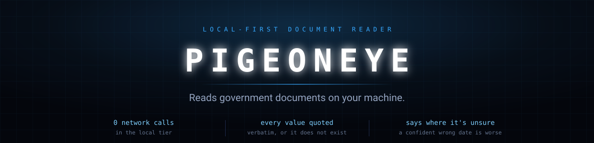
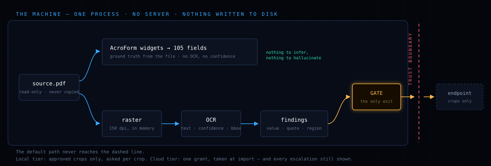
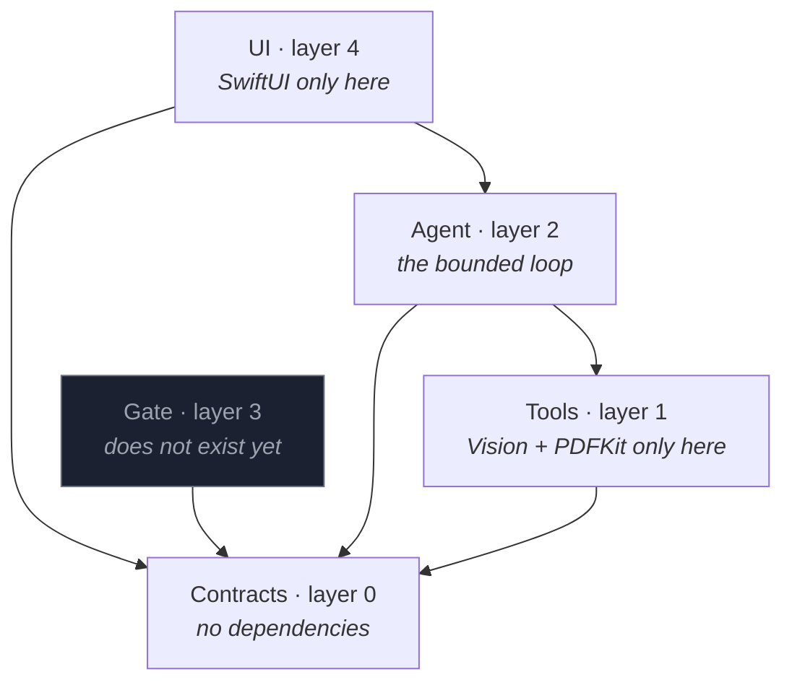

<div align="center">



<br>


**[Website](https://pigeoneyeai.vercel.app)** · **[Release v1.0.0](https://github.com/adisagar2003/PigeonEye/releases/tag/v1.0.0)** · **[Design notes](context/)** · **[Evaluation](eval/)**

</div>

---

## What it is

Photograph or import a confusing government document and get back a plain-language
explanation, the obligations and deadlines that actually matter, and a checklist of
what to do next — read **on your own machine**, with every claim quoted from the
source and every uncertain reading marked as uncertain.

The user is someone who receives an official document and cannot tell what it
obligates them to do. The failure they're avoiding isn't confusion — it's missing
one line and losing money, access, or legal standing.

### Why it isn't a summariser

Two properties, both load-bearing:

|   | |
|---|---|
| **Nothing leaves the machine unless you say so** | The documents people least want to upload are the ones they most need read. When a region is too unclear to read locally, the app shows you the exact crop it would send and asks. Declining still produces a result. |
| **It tells you where it's unsure** | A confident wrong date on a regulatory document is worse than no date. Every value carries a confidence reading and the verbatim words it came from. |

> [!IMPORTANT]
> Property 1 is a claim about the **local configuration**. On a machine without a
> local reasoning model the app falls back to a configured OpenAI-compatible
> endpoint — and it says so **at import**, on the screen where the document lands.
> Not in settings, not in a tooltip. A fallback you have to discover is the same
> as a lie.

---

## How it works

<div align="center">

</div>

The mode is decided by the file, not by a guess: **does any page carry a fillable
form field?**

| | Form mode | Document mode |
|---|---|---|
| Example | IRS 4835, Schedule F, NRCS CPA-1200 | EPA pesticide labels |
| Primary output | **the fields you must fill** — exact, read straight out of the file | findings, summary, next steps |
| Confidence | not applicable — the field list is ground truth | applies |

For born-digital government forms there is nothing to infer and nothing to
hallucinate. That is the strongest thing this product has.

**The deterministic tier is not a replacement for the agent — it is the agent's
tools.** Facts enter only through tools, each carrying a quote and a confidence,
so the agent *structurally cannot fabricate a deadline*.

```
TOOLS (deterministic, local, cannot hallucinate)     AGENT DECIDES
classify_document()  → form | document               mode, first move
list_form_fields()   → widgets + page + rect         which fields matter
ocr_page(n)          → lines + confidence + bbox     WHICH PAGES to read
detect_data()        → dates, money, rates, addrs    obligation vs noise
validate(v, kind)    → pass/fail + reason            good enough to show?
crop_region(p, rect) → image crop                    worth escalating?
escalate(crop)       → cloud read     [CONSENT]      ask the user, or skip
```

---

## Quick start

### Requirements

- **macOS 26** or later (Apple Vision `RecognizeDocumentsRequest`, PDFKit)
- **Swift 6.2** — `xcode-select --install`
- Python 3 for `eval/` only, and it's **stdlib only**; no `pip install` needed

There is no package manager, no bundler, no runtime to download and no model to
fetch. Every framework ships with the OS.

### Build and run

```sh
git clone git@github.com:adisagar2003/PigeonEye.git
cd PigeonEye

swift build              # the app and the `ocr` CLI
swift run PigeonEye      # open the app
swift test               # 113 tests, ~25s
```

Then use **`Open…`** — it is the only way a document enters the app. Point it at
anything in `assets/`:

| Try | To see |
|---|---|
| `assets/gov-forms/NRCS-CPA-1200-conservation-application.pdf` | form mode — 105 fields, read from the file, zero inference |
| `assets/epa-labels/000524-00529-20241120.pdf` | document mode over a 45-page label |
| `assets/scans/007969-00186-20080911-01.jpg` | a real photocopy: speckle, skew, a date OCR reads as `9/11/2098` |

### Asking about a page

Reading a document is entirely local and needs nothing configured. **Asking a
question about a page** is the one thing that leaves the machine, and it needs a
key:

| Variable | Default | |
|---|---|---|
| `OPENAI_KEY` or `OPENAI_API_KEY` | — | without one the ask panel says so and shows no field |
| `OPENAI_BASE_URL` | `https://api.openai.com/v1` | any OpenAI-compatible endpoint, including a local one |
| `OPENAI_MODEL` | `gpt-4o-mini` | |

Nothing reads `.env` — export it, or pass it on the command line:

```sh
OPENAI_KEY=sk-… swift run PigeonEye
```

`⌘K` puts the caret in the ask box; `?` lists every shortcut. Pick **On this
Mac** at first run and questions are answered by Apple's on-device model
instead, with no key and nothing leaving.

### Checks to run before any commit

```sh
sh scripts/layers.sh         # import rules + root allowlist
sh scripts/cli-contract.sh   # ./ocr --json still has the shape eval/ parses
```

`scripts/layers.sh` is mechanical, not advisory — it greps for `import Vision`
outside `Tools`, `import SwiftUI` outside `UI`, and any `URLSession` or `http`
outside `Gate`. The root is an **allowlist**: a file at the root has no directory,
so it has no layer and no import rule.

---

## The `ocr` CLI

`./ocr` is a **tracked launcher script**, not a copied binary — `eval/` and
`spikes/page_index.py` shell out to it, so it has to exist in a fresh clone. Don't
`cp` a build product over it.

```sh
./ocr assets/scans/007969-00242-20170111-01.jpg          # plain text
./ocr --json assets/scans/*.jpg                          # JSON array, one object per page
```

The `--json` shape is a contract that `eval/` parses, checked by
`scripts/cli-contract.sh`:

```jsonc
[{
  "transcript": "…",
  "lines": [{
    "text":  "CONSERVATION PROGRAM APPLICATION",
    "conf":  0.84,
    "bbox":  [x, y, width, height],   // upper-left origin — I12
    "title": true,
    "alts":  ["…"]                    // top candidates, for the homoglyph signal
  }],
  "tables": [], "lists": [], "data": []
}]
```

> [!WARNING]
> Apple's TextRecognition has a refcount race that segfaults while unwinding a
> finished request. A process-wide gate in `Tools.ocr` bounds concurrency and cuts
> the frequency — it **does not** close it, because the race is inside a single
> request's teardown. Don't assume OCR cannot take the process down.

---

## Evaluation

`eval/` scores any engine or model against real ground truth. The PDFs in
`assets/` are born-digital, so `pdftotext` gives free ground truth, and
`assets/scans/*.jpg` are the same pages deliberately degraded by `degrade.sh`. No
hand-labelling.

```sh
# score an OCR engine, then diff two runs
python3 eval/ocr_bench.py --out apple.json
python3 eval/ocr_bench.py --engine 'tesseract {img} stdout' --label tesseract --out tess.json
python3 eval/ocr_bench.py --compare apple.json tess.json

# score a reasoning model against the deadline traps — openai_run.py OCRs the
# case's scan itself and prints only the answer, so it pipes straight into score.py
OPENAI_API_KEY=sk-… python3 eval/openai_run.py epa-7969-242 \
  | python3 eval/score.py epa-7969-242
```

Any OpenAI-compatible endpoint works — point `--base-url` at a local server and
the same two commands score the local tier.

| Path | Purpose |
|---|---|
| `eval/ocr_bench.py` | CER · WER · **BER** · **NSCER** over any engine (`--engine '<cmd> {img}'`) |
| `eval/cases.json` | Two real EPA letters. Every value read off actual OCR output — nothing invented |
| `eval/score.py` | One scorer, any model. Reads the answer on stdin |
| `eval/openai_run.py` | Runner for any OpenAI-compatible endpoint. stdlib only |

The two cases are deliberately opposed: one requires **nothing** of the recipient;
the other carries a real obligation **plus** a relative deadline ("18 months from
the date of this letter") anchored against a decoy date. A model that invents
obligations fails the first; one that anchors the arithmetic to the decoy fails
`trap:wrong_deadline_anchor` explicitly, with the reason printed.

---

## What the measurements say

Everything below came out of running the thing over real EPA labels, IRS forms and
deliberately degraded scans. Full working in
[`context/progress-tracker.md`](context/progress-tracker.md).

| Measured | Result |
|---|---|
| Form fields read straight from the file | **63 / 89 / 105** — IRS 4835 · Schedule F · NRCS CPA-1200 |
| Reading the widget list, 45-page label | **~40 ms** — cheap enough to decide the mode before rasterising |
| 45-page EPA label, render + OCR, end to end | **23.3 s** — six pages in flight, debug build |
| OCR lines scored to build the confidence rule | **1 092** across 18 real degraded scans |
| Character error rate, EPA prose pages | **1.5 – 8 %** — the number that bears weight |
| Character error rate, length-weighted total | 26.9 % — misleading on forms, see below |
| Lines carrying a **homoglyph** disagreement | **8 of 1 092 (0.7 %)** — specific enough to trigger on |
| Lines carrying *any* candidate disagreement | 1 024 of 1 092 (93.8 %) — too noisy to be a signal |
| Findings produced over all of `assets/` | **8 421** |
| Numeric recall, flagship 45-page label | **73.8 %** — and it says so |

### Three things worth knowing

**CER is meaningless on forms.** `IRS-4835-1` scores 99.6 % CER but 41.7 % BER —
that's reordering, not misreading. `pdftotext` emits form content in PDF *object*
order, so the ground-truth ordering is itself arbitrary. BER exists to catch
exactly this, and it did.

**High OCR confidence is not a licence to show green.** The four *highest*
confidence scores in the corpus (0.885, 0.828, 0.824, 0.788) were all `口` —
checkbox artifacts read as CJK glyphs. The low end is trustworthy: a misread seal
scored 0.062, second-lowest of 1 092 lines. So the rules are **asymmetric** — below
threshold escalates, above threshold buys nothing without a validator pass.

**The gate escalates what was read badly, never what was not read at all.** On the
woody-brush rate table of the flagship label, OCR returns the plant names and drops
the rates — the only number that survives page 34 is the page number. Raising DPI
doesn't fix it and isn't even monotonic (digits found at 150/220/300/400 dpi:
**2 / 82 / 39 / 2**). A line Vision never emitted has no bbox and no confidence, so
**absence has no confidence** — it gets named instead of hidden.

### Engines evaluated

| Engine | CER | WER | BER | NSCER | Verdict |
|---|---|---|---|---|---|
| **apple-vision** | **26.9 %** | **28.3 %** | **20.1 %** | **26.2 %** | the local tier |
| tesseract | 27.8 % | 32.7 % | 31.6 % | 27.5 % | credible portable fallback |
| rapidocr | 54.5 % | 85.3 % | 97.1 % | 47.6 % | **rejected** — ships only the Chinese recogniser |
| mere.run | — | — | — | — | **ruled out** — wants 16 GB headroom on a 16 GB machine |

---

## Repo map

| Path | Holds |
|---|---|
| `Sources/Contracts/` | layer 0 — types with no dependencies |
| `Sources/Tools/` | layer 1 — OCR, raster, form widgets, findings, crop. The only place `Vision` and `PDFKit` are imported |
| `Sources/Agent/` | layer 2 — the bounded read loop, the page index, export |
| `Sources/UI/` | layer 4 — SwiftUI. The only place `SwiftUI` is imported |
| `Sources/ocr-cli/` | the `ocr` executable |
| `assets/` | real documents: EPA labels, IRS/NRCS forms, and the same pages degraded |
| `eval/` | measurement harness — Python, stays at root because it is not a layer |
| `spikes/` | prototypes that have not earned a layer; each header names the slice that deletes it |
| `context/` | **the source of truth for *why*** |
| `scripts/` | the two greps that enforce all of the above |

### Layers — imports point down only

A file's layer **is its directory**, and a target's dependency list in
`Package.swift` is the enforcement, not a reviewer's judgement.



Layer 3 is empty on purpose: there is no egress yet, and `rg 'URLSession|http'
Sources` must stay empty until there is.

---

## Invariants

Thirteen of them, each written to be checkable by a test rather than by
inspection. The authoritative table is
[`context/architecture.md` §8](context/architecture.md). The load-bearing ones:

| # | Invariant |
|---|---|
| **I1** | Nothing crosses the trust boundary outside the scope consented to for *this* document |
| **I2** | Every rendered value traces to a quote that is a verbatim substring of the transcript |
| **I3** | A finding failing its format validator can never render green |
| **I4** | Confidence is never solely model self-report |
| **I5** | "read pages X–Y of N" is always visible, never behind a disclosure |
| **I7** | The source file is never modified |
| **I9** | Nothing survives the session — no persistence path exists |
| **I12** | Bounding boxes are interpreted in one consistent coordinate origin |

> [!NOTE]
> **I2 is enforced at one construction point**, not per caller — a caller cannot
> invent a quote because a caller cannot build a `Finding` any other way. **I12**
> exists because Vision defaults to a lower-left origin while PDFKit is upper-left;
> handled inconsistently, you escalate the *mirrored region* and silently send
> something the user never approved.

---

## Feature status

| # | Feature | Spec | Status |
|---|---|---|---|
| F1 | Read it locally | [`01-read-it-locally.md`](context/features/01-read-it-locally.md) | ✅ complete |
| F2 | Form mode | [`02-form-mode.md`](context/features/02-form-mode.md) | 🟡 2.1 complete, 2.2 deferred |
| F3 | Findings you can trust | [`03-findings-you-can-trust.md`](context/features/03-findings-you-can-trust.md) | 🟡 3.1 + 3.4 complete, 3.2 + 3.3 open |
| F4 | Explain it | — | ⬜ not started |
| F5 | Escalate with consent | — | ⬜ not started |
| F6 | Fail honestly | — | ⬜ not started |
| F7 | Inspector mode | — | 🟡 step log shipped in F1 |
| F8 | Export | — | ✅ complete — built out of order |

Vertical slices, not layers. The old order was horizontal and nothing rendered
until stage 7.

---

## Documentation

`context/` is the single source of truth for *why*. A change that alters the why
without changing `context/` is incomplete.

| File | Answers |
|---|---|
| [`context/project-overview.md`](context/project-overview.md) | What the product is, who it's for, and what it will **not** do |
| [`context/architecture.md`](context/architecture.md) | Stack, boundaries (§6), storage (§7), **invariants I1–I13** (§8), output contract (§11), confidence composite (§12) |
| [`context/progress-tracker.md`](context/progress-tracker.md) | Current phase, build order, what measurement settled, open decisions, decision log |
| [`context/coding-standards.md`](context/coding-standards.md) | Layers (§1), naming (§2–3), TDD (§4), observability (§5), review checklist (§8) |
| [`ai-workflow.md`](ai-workflow.md) | How an agent works here — one build-order row at a time, ask before assuming |

### Storage model

There isn't one, deliberately.

| Data | Lives | Persisted? |
|---|---|---|
| Source PDF | the user's chosen path | read-only, never copied |
| Page images, OCR lines, findings | process memory | no |
| Escalation crops | memory, until sent or discarded | no |
| API key | Keychain, or an env var | never logged, never rendered |

No database. No cache. No queue. No server. **Nothing to GDPR.**
